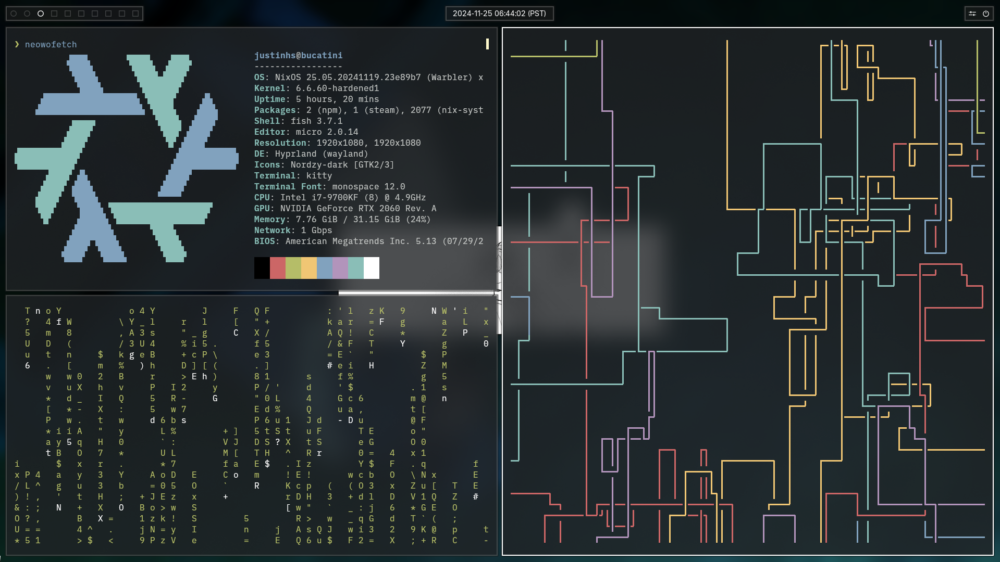

# nixos-config

[NixOS](https://nixos.org/) is a declarative and reproducible Linux distribution, meaning ALL the software on your computer is defined in a series of configuration files you can take with you and install anywhere. Without being able to configure everything through Nix, I wouldn't have bothered setting all this up.

- It also does a lot more, but I could be a lot better at explaining things I don't fully comprehend yet.

Much of the NixOS documentation is lackluster or impossible to find, the Nix language is difficult to get a half-decent grasp of (my puny Java-dev mind is still getting used to it), and the primary advice to learn is reading through the code defining each package you want to use--which if you're starting off, you probably won't understand. Despite this, if you love tinkering and hate computers doing what you don't tell them to, I *highly* recommend looking into NixOS.

This repo serves as a record of how my config has evolved over time and everything I'm actively learning to set up. Since this also serves as production for most of my computers now, I'll try to keep the main branch not broken, but no guarantees there. I've tried to leave comments and citations here and there to document my learning process and hopefully help out anyone who for some unknown reason decides to dive into my config specifically. Have fun in there.

## Screenshots

Wallpapers are from [Given](https://given-anime.com) and [Hoshiai no Sora](https://8bit-studio.co.jp/works/hoshiainosora).

## Installation

See the [wiki](https://github.com/justinhschaaf/nixos-config/wiki/Installation).

> [!NOTE]
> If you're using one of the setups with a GUI, you need to manually set the wallpaper with `swww img`.

## Developing

To make development easier, this flake provides a dev shell you can enter using [direnv](https://github.com/nix-community/nix-direnv) or by running `nix develop`.

You can then run `jstestvm <system>` to quickly compile and run a virtual machine of any system in the flake.

## Systems

- **bucatini**, the gaming PC.
- **farfalle**, the [laptop](https://frame.work/products/laptop-diy-13-gen-amd/configuration/new).
- **lasagna**, the bedroom TV.
- **tortelli**, the server.

## File Structure

- [`flake.nix`](flake.nix) is the main file in the repository, where the dependencies (inputs) and components (modules) of each system get defined.
- [`systems`](systems) is where the main config files for each of my systems live. As of writing, each system has a main file for its software, which imports a secondary, auto-generated file for its hardware.
- [`modules`](modules) is where the general configuration modules can be found. This defines the options enabled by default for all systems along with other options systems can pick and choose based on their needs.
    - [`desktop`](modules/desktop) holds anything you'd expect a GUI/desktop environment to have. Here, you can find the setup for [Hyprland](https://hyprland.org/) (the main thing you see), all fonts installed on the system, and the keyboard (specifically, the Japanese one).
    - [`hardware`](modules/hardware) has hardware-specific defaults, such as for my PC's NVIDIA GPU and my laptop's fingerprint reader.
    - [`programs`](modules/programs) contains most general-purpose applications you may want on a system. These are organized by use case.
    - [`server`](modules/server) defines various web services for my homelab.
    - [`utils`](modules/utils) is effectively miscellaneous services you may want on the system, such as automatic updates and backups.
- [`users`](users) defines the accounts to create at the system level.
- [`hmmodules`](hmmodules) are where per-user configuration modules are found, managed by [Home Manager](https://nix-community.github.io/home-manager/). Anything that can't be defined for the whole system lives here.
- [`hmusers`](hmusers) are where the personal preferences for each account are set. These depend on `hmmodules`.
- [`scripts`](scripts) hosts shell scripts the system depends on. These are exported by `flake.nix` as packages.
- [`secrets`](secrets) contains declarative data which some systems depend on but needs to stay private. These are protected by [sops-nix](https://github.com/Mic92/sops-nix).

## References

These inspired the direction I wanted to take my setup in when I was first getting started. This is by no means a comprehensive list, as most references are cited near the code I used from them. These may not also reflect how the repository turned out, as again, I used these a year ago.

### Technical

- [davidak/nixos-config](https://github.com/davidak/nixos-config/tree/master)
- [MayNiklas/nixos](https://github.com/MayNiklas/nixos)
- [Modularize NixOS and Home Manager | Great Practices](https://www.youtube.com/watch?v=vYc6IzKvAJQ)

### Aesthetics

- [[Hyprland] vertical waybar, foot, swaync, neovim and tofi](https://www.reddit.com/r/unixporn/comments/179kz17/hyprland_vertical_waybar_foot_swaync_neovim_and/)
- [[AwesomeWM] Vertical Stuff!](https://www.reddit.com/r/unixporn/comments/xzknn3/awesomewm_vertical_stuff/)
- [[hyprland] Mocha ~](https://www.reddit.com/r/unixporn/comments/zos11o/hyprland_mocha/)
- [[hyprland] glassmorphism?](https://www.reddit.com/r/unixporn/comments/ys4nfs/hyprland_glassmorphism/)
- [linkfrg's Hyprland(and eww!) dotfiles](https://github.com/linkfrg/dotfiles/tree/main)
- [1amSimp1e's Dot Files](https://github.com/1amSimp1e/dots)
